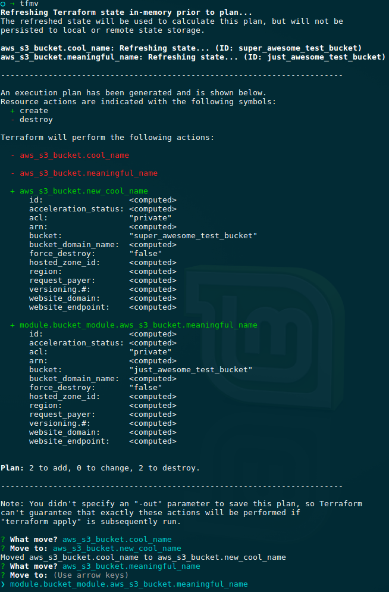

# Terraform state move helper

Interactive CLI for moving resources in a Terraform state.

## Motivation

Sometimes you need to refactor your config. Move resources to the separate module, rename a resource, etc.
Terraform will plan to recreate resources in this case. You can use command `terraform state mv` to prevent this.
But it can be pretty routine. This tool helps you easily do this. Just select from the list source resource, then destination, press enter, repeat.

## How to use

```
npm i -g tfmv
tfmv
```

## Example



